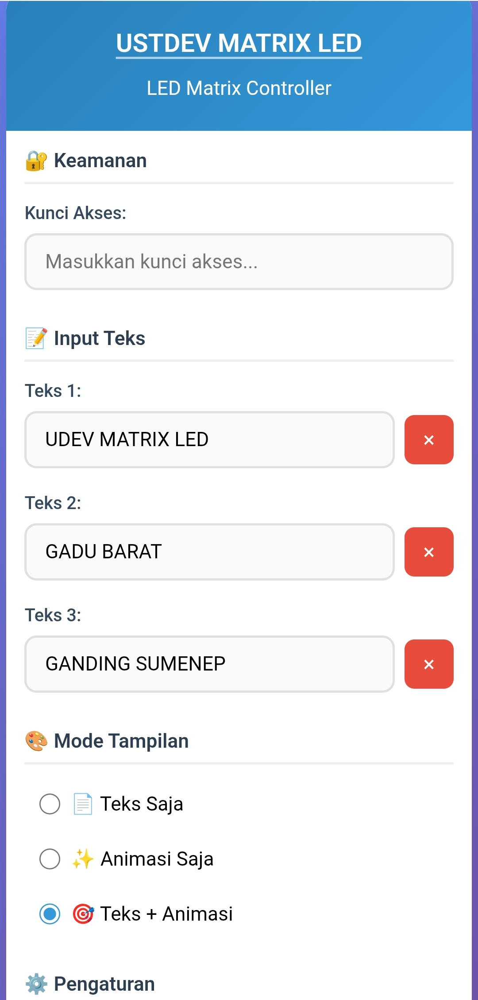

# MAX7219 LED Matrix 16x8 Display

## 📝 Deskripsi
Proyek ini merupakan implementasi LED Matrix 16x8 menggunakan chip MAX7219 dengan ESP32. Dengan sistem ini, Anda dapat menampilkan teks berjalan, animasi, dan berbagai tampilan menarik pada panel LED matrix.

## ✨ Fitur
- 🔄 Tampilan scrolling text
- ⚙️ Konfigurasi mudah melalui web interface
- 📱 Mendukung kontrol via WiFi
- 🌈 Multiple efek animasi
- ⚡ Penggunaan daya rendah

## 📋 Prasyarat
- ESP32 board
- MAX7219 LED Matrix 16x8 (2 modul 8x8 yang digabungkan)
- Kabel jumper
- Power supply 5V
- Akses WiFi

## 🛠️ Instalasi

### Hardware Setup
1. Hubungkan modul MAX7219 dengan ESP32 menggunakan pin berikut:
   - VCC ke 5V
   - GND ke GND
   - DIN ke GPIO 23 (MOSI)
   - CS ke GPIO 5 (SS)
   - CLK ke GPIO 18 (SCK)

2. Gabungkan dua modul LED Matrix 8x8 untuk membentuk tampilan 16x8

### Flashing Binary
1. Download [ESP32 Flash Download Tool](https://www.espressif.com/en/support/download/other-tools)
2. Jalankan tool tersebut dan pilih mode ESP32
3. Masukkan `MAX7219_LED_MATRIX_16x8.ino.esp32.bin` pada alamat 0x10000
4. Pilih port COM yang sesuai dengan ESP32 Anda
5. Klik Start untuk memulai flashing

### Konfigurasi WiFi
1. Setelah flash selesai, ESP32 akan membuat access point dengan nama "UDEV MATRIXLED"
2. Hubungkan perangkat Anda ke access point tersebut menggunakan password "55555555"
3. Buka browser dan akses `192.168.1.1`
4. Masukkan informasi WiFi rumah Anda untuk menghubungkan perangkat ke jaringan

## 📸 Preview

### Tampilan Web Interface

### Demo Running Display

## 🔧 Pengaturan

Setelah terhubung ke jaringan WiFi, Anda dapat mengakses antarmuka kontrol dengan mengetikkan IP address ESP32 di browser. Di halaman pengaturan, Anda dapat:

1. Mengatur teks yang akan ditampilkan
2. Mengubah kecepatan scrolling
3. Memilih efek animasi
4. Mengatur kecerahan LED
5. Menjadwalkan waktu tampilan on/off

## 🤝 Kontribusi
Kontribusi selalu diterima dengan baik! Silakan fork repositori ini, buat perubahan, dan ajukan pull request.

## 📄 Lisensi
Proyek ini dilisensikan di bawah [MIT License](LICENSE).

## 📞 Kontak
- GitHub: [AhmadMuzayyin](https://github.com/AhmadMuzayyin)
- Email: muzayyin.dev@gmail.com

---

⭐ Jika Anda menyukai proyek ini, jangan lupa untuk memberikan bintang di GitHub! ⭐